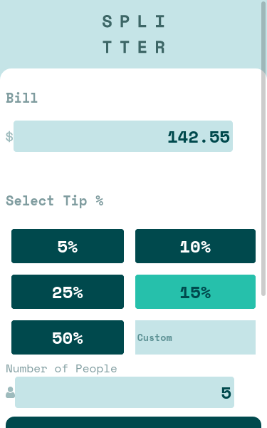
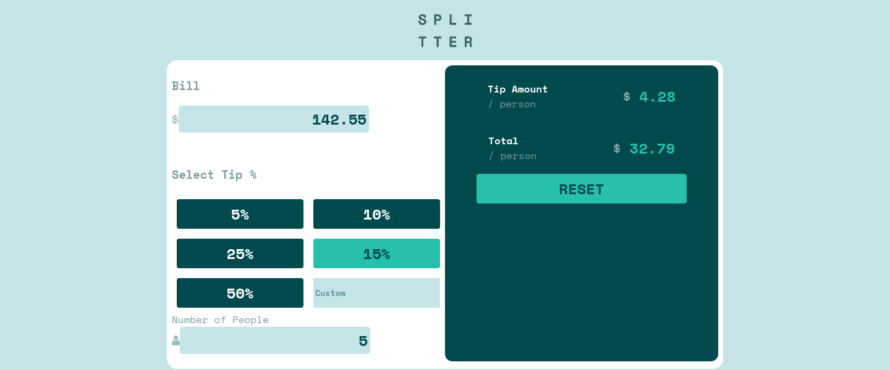

# Frontend Mentor - 

Esta es una solución para el [Tip calculator app challenge on Frontend Mentor](https://www.frontendmentor.io/challenges/tip-calculator-app-ugJNGbJUX). Los retos de Frontend Mentor pueden ayudarte a mejorar tus habilidades por medio de crear proyectos reales.

## Tabla de contenidos

- [Información general](#información-general)
  - [El reto](#el-reto)
  - [Screenshot](#screenshot)
  - [Links](#links)
- [Mi proceso](#mi-proceso)
  - [Herramientas utilizadas](#herramientas-utilizadas)
	- [Lo que aprendí](#lo-que-aprendí)
- [Autor](#autor)

## Información general

### El reto

El usuario deberá ser capaz de:

- Ver el correcto diseño dependiendo de la resolución de su dispositivo.
- Ver los estados de hover al interactuar con la página.
- Mostrar los valores correctos al calcular los gastos.

### Screenshot

### Links
- URL para la solución: [Solution page]()
- URL para probar el sitio: [Github pages]()

## Mi proceso

### Herramientas utilizadas

- HTML
- Sass
- Mobile-first workflow

## Autor

- Frontend Mentor - [@Caresle](https://www.frontendmentor.io/profile/Caresle)
- Instagram - [@caresle1](https://instagram.com/caresle1)
- Twitter - [@caresle1](https://twitter.com/Caresle1)