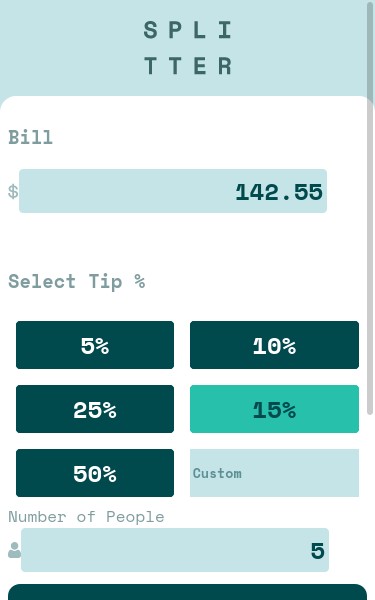

# Frontend Mentor - Tip calculator app solution

This is a solution to the [Tip calculator app challenge on Frontend Mentor](https://www.frontendmentor.io/challenges/tip-calculator-app-ugJNGbJUX). Frontend Mentor challenges help you improve your coding skills by building realistic projects.

## Table of contents

- [Overview](#overview)
  - [The challenge](#the-challenge)
  - [Screenshot](#screenshot)
  - [Links](#links)
- [My process](#my-process)
  - [Built with](#built-with)
- [Author](#author)

## Overview

### The challenge

Users should be able to:

- View the optimal layout for the app depending on their device's screen size
- See hover states for all interactive elements on the page
- Calculate the correct tip and total cost of the bill per person

### Screenshot

### Links

- Solution URL: [Solution page](https://www.frontendmentor.io/solutions/sass-rnz0exoc5)
- Live Site URL: [Github pages](https://caresle.github.io/tip-calculator/)

## My process

### Built with

- HTML
- Sass
- Mobile-first workflow

## Author

- Frontend Mentor - [@Caresle](https://www.frontendmentor.io/profile/Caresle)
- Instagram - [@caresle1](https://instagram.com/caresle1)
- Twitter - [@caresle1](https://twitter.com/Caresle1)
